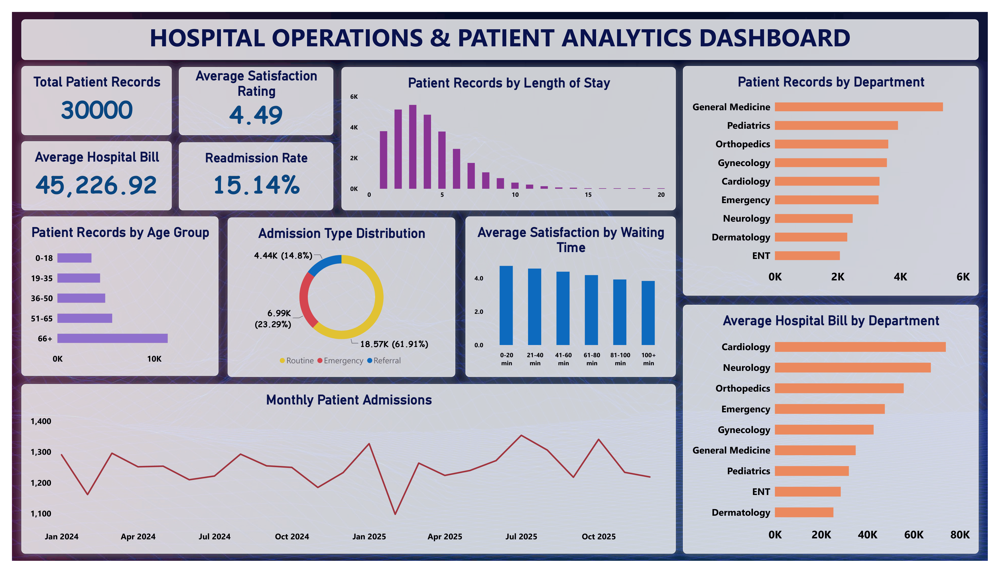

# Hospital Operations & Patient Analytics

A data analytics project focused on analyzing hospital patient and operational data using **Excel, SQL, Python, and Power BI**.

## Project Overview

This project analyzes hospital data from 2024–2025 to understand patient volume, department activity, billing, demographics, waiting time, satisfaction, and readmission patterns.

The raw data was cleaned in Excel, analyzed using SQL and Python, and presented through a Power BI dashboard.

## Problem Statement

Hospital data can contain duplicate records, missing values, and inconsistent entries, making it difficult to analyze directly.

This project focuses on cleaning and analyzing hospital data to generate useful insights about hospital operations and patient experience.

## Tools Used

- Excel – Data Cleaning
- PostgreSQL – SQL Analysis
- Python – Exploratory Data Analysis
- Power BI – Dashboard & Visualization

## Project Workflow

**Raw Data → Excel Cleaning → SQL Analysis → Python EDA → Power BI Dashboard → Final Insights**

## Dataset

- Original Records: 30,075
- Cleaned Records: 30,000
- Columns: 24
- Period: January 2024 – December 2025

## Key Analysis Areas

- Patient volume by department
- Monthly admission trends
- Average hospital billing
- Department-wise treatment costs
- Patient age groups
- Waiting time and satisfaction
- Readmission patterns
- Discharge outcomes

## Key Findings

- Total cleaned patient records: **30,000**
- General Medicine recorded the highest patient volume with **5,364 records**
- Cardiology had the highest average hospital bill at **₹73,942.90**
- Average hospital bill: **₹45,226.92**
- Patients aged 66+ represented **38.08%** of records
- Average patient satisfaction: **4.49 / 5**
- Readmission rate: **15.14%**
- Waiting time and satisfaction showed a negative correlation (**r = -0.39**)
- Length of stay and total bill showed a positive correlation (**r = 0.55**)

## Dashboard Preview

## Project Files

1. [Cleaned Dataset](1_hospital_operations_patient_analytics.csv)
2. [SQL Analysis](2_hospital_operations_patient_analytics.sql)
3. [Python EDA Notebook](3_hospital_operations_patient_analytics.ipynb)
4. [Dashboard Preview](4_hospital_operations_patient_analytics_dashboard.png)
5. [Final Analysis Report](5_hospital_operations_patient_analytics_report.pdf)

## Conclusion

This project demonstrates how hospital data can be cleaned, analyzed, and transformed into useful insights using common data analytics tools.
